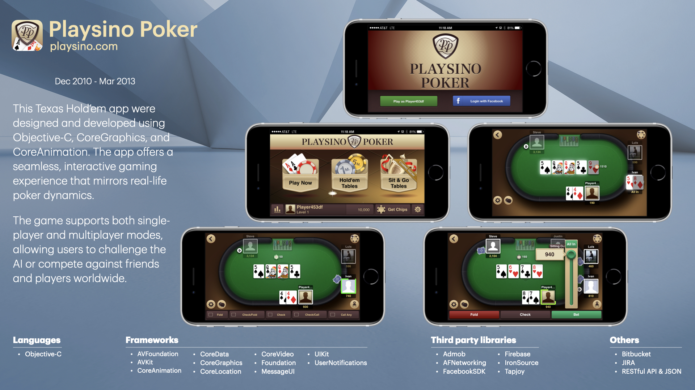

# Serhii Horinenko
Hi, I am a passionate iOS engineer from Vancouver, Canada with experience of designing, building, and maintaining applications throughout the product lifecycle in Swift, SwiftUI, UIKit , and Objective-C. Experienced with research and development in both large and small teams across a wide range of industries.

## Portfolio
[Full version of the portfolio in pdf format](https://docs.google.com/viewer?url=https://github.com/SergeyGorinenko/SergeyGorinenko/blob/main/docs/Senior%20iOS%20Engineer%20-%20Portfolio.pdf)

## Forma Vision
[Forma Vision](https://formavision.io) app allows remote and hybrid teams to participate in holographic meetings. Mobile phone users can see holograms in Augmented Reality and send a 2D video of themselves to these holographic participants and other mobile phone users.

##### 🔨Technologies: SwiftUI, Combine, MVVM, ARKit, MetalKit, SceneKit, GLTF, WebRTC, RESTful API, JSON.
##### 🚀Platform: 📱iOS, iPad.

## MakeDeal
[MakeDeal](https://makedeal.io) app provides users with a smart keyboard that makes daily work easier by using customizable message templates. The extension can be used by any popular chat application or correspondence.

##### 🔨Technologies: SwiftUI, Combine, MVVM, CoreData, Keyboard extension, WebKit, RESTful API, JSON.
##### 🚀Platform: 📱iOS, iPad.

## Convosight
[Convosight](https://convosight.com) app empowers Facebook community leaders by providing them with professional tools, expertise, and brand connections. They can have promotional discussions with brands while managing the content of their groups to ultimately monetize their community.

##### 🔨Technologies: SwiftUI, Combine, CoreData, UIKit, AWSAppSync, Amplify, Firebase, Graph QL, RESTful API, JSON.
##### 🚀Platform: 📱iOS, iPad.

## Performlive
[Performlive](https://performlive.live) app allows people to sell products live or broadcast their knowledge and skills to participants in high-quality audio and video directly from their iOS devices. The audience can buy goods online, interact through live comments and virtual applause, and can participate in performances when invited to the stage by a performer.

##### 🔨Technologies: SwiftUI, Combine, CoreData, CoreGraphics, StoreKit, UIKit, Agora, Facebook API, Firebase, Graph QL, RESTful API, JSON.
##### 🚀Platform: 📱iOS, iPad.

## ROAR
[ROAR](https://theroar.io) Augmented Reality Scanner allows users to interact with physical world enhanced through digital content which can include Photos, Videos, Text, Audio, 3D models, Motion graphics with Chromakey & Lumakey, and Geolocation-based notifications. Users scan physical markers or images that have been enhanced with AR content, or view ARKit augmented reality experiences.

##### 🔨Technologies: Objective-C, CoreData, CoreGraphics, CoreLocation, SceneKit, UIKit, Push Notifications, Vuforia, RESTful API, JSON.
##### 🚀Platform: 📱iOS, iPad.

## ROAR Inspired Apps
[ROAR Inspired Apps](https://theroar.io)

##### 🔨Technologies: Objective-C, CoreData, CoreGraphics, CoreLocation, SceneKit, UIKit, Push Notifications, Vuforia, RESTful API, JSON.
##### 🚀Platform: 📱iOS, iPad.

## SpinToWin Slots & Sweepstakes
[SpinToWin Slots & Sweepstakes](https://spintowinslots.net) is a vibrant and exciting iOS app that offers users a fun and interactive way to play Vegas-style casinos, slots and lotteries straight from their mobile devices. This app provides a thrilling experience with the chance to win real prizes and cash rewards.

##### 🔨Technologies: Objective-C, CoreAnimation, CoreGraphics, CoreLocation, UIKit, Push Notifications, Ad Networks, RESTful API, JSON.
##### 🚀Platform: 📱iOS, iPad.

## Mirror Football
[Mirror Football](https://mirror.co.uk) app provides customers with football news, opinions and live action from journalists and bloggers covering every league and cup competition. The app contains breaking news and transfers, videos, galleries and in-depth analysis.

##### 🔨Technologies: Objective-C, CoreData, CoreGraphics, CoreLocation, UIKit, Push Notifications, RESTful API, JSON.
##### 🚀Platform: 📱iOS, iPad.

## Playsino Poker
[Playsino Poker](https://playsino.com) Texas Hold’em app were designed and developed using Objective-C, CoreGraphics, and CoreAnimation. The app offers a seamless, interactive gaming experience that mirrors real-life poker dynamics. The game supports both single-player and multiplayer modes, allowing users to challenge the AI or compete against friends and players worldwide.

##### 🔨Technologies: Objective-C, CoreAnimation, CoreGraphics, CoreLocation, UIKit, Push Notifications, WebSocket API.
##### 🚀Platform: 📱iOS, iPad.

